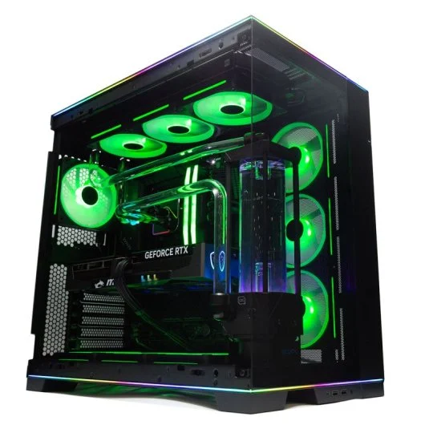

# Fase 3 – Documentación do equipo
1. Procura na rede diferentes manuais do teu equipo como poden ser o monitor, placa base, tarxeta gráfica, ... calquera dispositivo que empregues no teu PC. 

* [Monitor Philips LCD 4k Ultra HD](https://www.philips.es/c-p/276E8VJSB_00/monitor-lcd-4k-ultra-hd/soporte)
* [Auroa ACT 1250 Manual](https://www.dell.com/support/manuals/es-es/alienware-aurora-act1250-gaming-desktop/act1250-owners-manual/Vistas-de-Alienware-Aurora-ACT1250?guid=guid-0882cfdc-c140-418b-942d-feaed12da755&lang=es-mx)

2. Engade  imaxes do teu equipo no documento `03_documentacion_equipo.md`.

4. Engade ligazóns as webs oficiais das aplicacións instaladas no apartado anterior. 

* [Chrome](https://www.google.com/intl/es_es/chrome/)
* [Adobe PDF](https://get.adobe.com/es/reader/)
Documenta as tarefas indicadas en  `03_documentacion_equipo.md`.

[Voltar ao incio](README.MD)